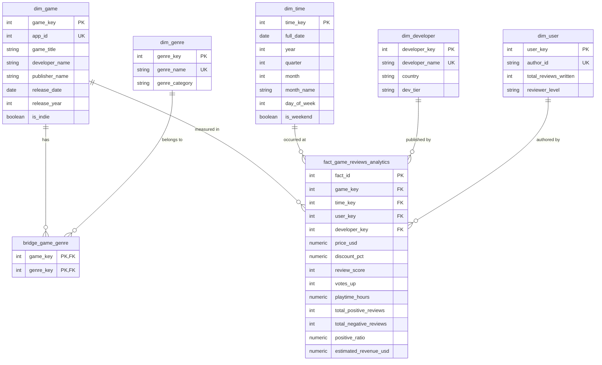

# 🎮 Steam Games Analytics Data Warehouse (`DM_Project`)

[](https://www.postgresql.org/)
[](https://en.wikipedia.org/wiki/Star_schema)
[](https://www.python.org/)
[](scripts/olap_queries.sql)
[](docs/DATA_WAREHOUSE_DOCUMENTATION.md)

Progetto universitario completo per l'esame di **Data Management / Gestione dei Dati e Sistemi di Supporto alle Decisioni**.

Il progetto progetta e implementa un **Data Warehouse (DW)** multidimensionale basato su uno **Schema a Stella (Star Schema)** in **PostgreSQL** (con supporto integrato e portabile anche per SQLite) per analizzare il mercato dei videogiochi della piattaforma **Steam**.

---

## 🎯 Obiettivi del Progetto

> *"The goal of the project is to design and implement a Data Warehouse for analyzing Steam games. The data coming from multiple datasets will be integrated through an ETL process and organized into a star schema in PostgreSQL. The project will include OLAP queries and visual reports to analyze trends such as the relationship between game price, user reviews, genres, developers, release dates, and popularity. The objective is to show how a Data Warehouse can support decision-making through multidimensional analysis."*

Attraverso questo progetto si risponde a domande di business strategiche per publisher e sviluppatori:
1. **Elasticità e Dinamica dei Prezzi**: In che modo il prezzo di lancio e gli sconti influenzano le ore di gioco e il sentiment delle recensioni degli utenti?
2. **Confronto AAA vs Indie**: Come si differenziano i grandi studi multinazionali rispetto ai team indipendenti in termini di approvazione della community e fatturato generato?
3. **Analisi Temporale e Stagionalità**: Come si distribuiscono le recensioni e i ricavi su scala annuale, trimestrale (QoQ) e feriale/festiva (weekend effect)?
4. **Ranking di Gradimento per Genere**: Quali sono i titoli leader per numero di recensioni positive all'interno di ciascun genere videoludico?

---

## 🏛️ Architettura Multidimensionale (Star Schema)

Il modello logico adotta uno **Schema a Stella** incentrato sulla tabella dei fatti `fact_game_reviews_analytics` e supportato da una tabella ponte per gestire la relazione N:M tra giochi e generi:



### Granularità della Tabella dei Fatti
Ogni tupla di `fact_game_reviews_analytics` rappresenta **una singola recensione pubblicata da uno specifico utente per un gioco, associato al suo sviluppatore e ad una data**, arricchita con le metriche del titolo al momento del censimento.

---

## 📁 Struttura del Repository

```
DM_Project/
├── data/
│   ├── raw/                           # Dataset sorgenti CSV grezzi
│   │   ├── steam_games.csv            # Dati anagrafici, prezzi, sconti, sviluppatori
│   │   └── steam_reviews.csv          # Recensioni utente, rating, playtime, timestamp
│   └── processed/                     # Data Warehouse locale
│       └── steam_dw.db                # Database SQLite sincronizzato
├── scripts/
│   ├── fetch_real_steam_data.py       # Ingestione dataset reali da Kaggle e Steam Store Web API
│   ├── generate_dataset.py            # Generatore dataset sintetici (backup offline)
│   ├── schema.sql                     # DDL Star Schema PostgreSQL (Staging, Dim, Fact, Indici)
│   ├── etl_pipeline.py                # Pipeline ETL automatizzata (Extract, Transform, Load)
│   ├── olap_queries.sql               # Suite delle 10 query analitiche OLAP
│   ├── run_olap_queries.py            # Runner ed esecutore query con calcolo latenze
│   └── demo_presentation.py           # Runner interattivo di validazione delle operazioni OLAP
├── dashboard/
│   ├── app.py                         # Web App Interattiva con live SQL OLAP Runner (Porta 8501)
│   ├── export_reports.py              # Generatore di grafici analitici ad alta risoluzione (PNG)
│   └── plots/                         # Grafici statistici esportati
│       ├── revenue_by_genre.png       # Fatturato per genere e dev tier
│       ├── qoq_revenue_trend.png      # Trend temporale quarter-over-quarter
│       ├── price_sentiment_analysis.png # Elasticità del prezzo e sentiment
│       └── developer_market_share.png # Quote di mercato degli sviluppatori
├── docs/
│   └── DATA_WAREHOUSE_DOCUMENTATION.md # Relazione accademica completa per l'esame
└── README.md
```

---

## 🚀 Guida Rapida all'Esecuzione

Tutti gli script sono progettati per l'esecuzione diretta da riga di comando.

### 1. Prerequisiti
Assicurarsi di avere installato Python 3.10+ e le librerie necessarie:
```bash
pip install psycopg2-binary pandas matplotlib numpy
```
PostgreSQL deve essere attivo con il database `steam_dw` (oppure verrà utilizzato in automatico il motore SQLite integrato).

### 2. Acquisizione dei Dataset Reali (Kaggle & Steam Web API)
```bash
# Scarica i giochi da Kaggle/SteamSpy e raccoglie recensioni reali dalle Steam API
python3 scripts/fetch_real_steam_data.py

# (In alternativa, per lavorare offline senza rete, è disponibile il generatore sintetico):
# python3 scripts/generate_dataset.py
```

### 3. Esecuzione della Pipeline ETL
```bash
# Esegue l'ETL popolando il Data Warehouse PostgreSQL e la copia SQLite
python3 scripts/etl_pipeline.py --target both
```
*Esegue l'estrazione, il data cleaning, la generazione delle chiavi surrogate, l'ingestione nelle dimensioni e il caricamento batch ad alte prestazioni nei fatti.*

### 4. Runner Interattivo di Validazione OLAP (5 Minuti)
```bash
# Esegue la suite guidata con spiegazione degli operatori OLAP e benchmark di latenza
python3 scripts/demo_presentation.py

# Oppure in modalità di esecuzione automatica:
python3 scripts/demo_presentation.py --auto --delay 4
```
*Valida passo-passo Star Schema, Roll-up, Slice & Dice con bridge table, Window Functions (`DENSE_RANK`, `LAG`) ed elasticità del prezzo.*

### 5. Esecuzione della Suite Completa Query OLAP
```bash
# Esegue tutte le 10 query dimensionali in sequenza su PostgreSQL
python3 scripts/run_olap_queries.py --engine postgres
```
*Esegue in pochi millisecondi Rollup, Slice & Dice, Window Functions (`DENSE_RANK`, `LAG`), elasticità del prezzo e matrici di mercato.*

### 6. Generazione dei Grafici Visivi (PNG)
```bash
python3 dashboard/export_reports.py
```
*Esporta i grafici analitici a 300 DPI in `dashboard/plots/`.*

### 7. Avvio della Dashboard Interattiva
```bash
python3 dashboard/app.py
```
Apri il browser su **`http://localhost:8501`** per esplorare la dashboard web con KPI, grafici interattivi e runner SQL live con visualizzazione istantanea dei risultati.

---

## 📊 Sintesi delle Query OLAP Implementate

| # | Query OLAP | Operazione | Obiettivo Analitico |
|---|---|---|---|
| **Q1** | Rollup Temporale | `ROLLUP` / Gerarchia Data | Fatturato, prezzo medio e rating aggregati per Anno e Trimestre |
| **Q2** | Slice & Dice Categorie | `SLICE & DICE` | Confronto tra AAA, AA e Indie per genere videoludico |
| **Q3** | Ranking Giochi per Genere | `DENSE_RANK() OVER (...)` | Top 3 titoli con il maggior numero di recensioni positive per genere |
| **Q4** | Elasticità del Prezzo | `CASE WHEN` Bracket Analysis | Analisi incrociata tra fasce di prezzo, ore giocate e rating |
| **Q5** | Profilazione Recensori | `GROUP BY` Livello Utente | Comportamento e utilità voti di utenti Casual, Enthusiast ed Expert |
| **Q6** | Crescita Trimestrale | `LAG() OVER (...)` | Percentuale di variazione QoQ (*Quarter-over-Quarter*) del fatturato |
| **Q7** | Weekend vs Weekday | Dicing temporale | Differenze nel volume e nel sentiment nei giorni feriali vs festivi |
| **Q8** | Developer Market Share | Ranking Multidimensionale | Fatturato lordo e gradimento medio dei principali studi mondiali |
| **Q9** | Cohort Anno di Rilascio | Cohort Analysis | Misurazione della longevità (*long tail*) dei giochi nel catalogo |
| **Q10** | Pricing Power per Genere | Bridge Join & Aggregazione | Prezzo medio effettivo e tasso di sconto medio per genere |

---

## 📖 Documentazione Accademica Completa
La relazione di progetto dettagliata con trattazione teorica formale, modelli matematici, motivazioni architetturali e analisi dei risultati è consultabile in [docs/DATA_WAREHOUSE_DOCUMENTATION.md](docs/DATA_WAREHOUSE_DOCUMENTATION.md).

---

## 👨‍🎓 Autore e Licenza
Progetto sviluppato a fini accademici per il corso di **Data Management / Gestione dei Dati**.  
Distribuito con licenza **MIT**.
