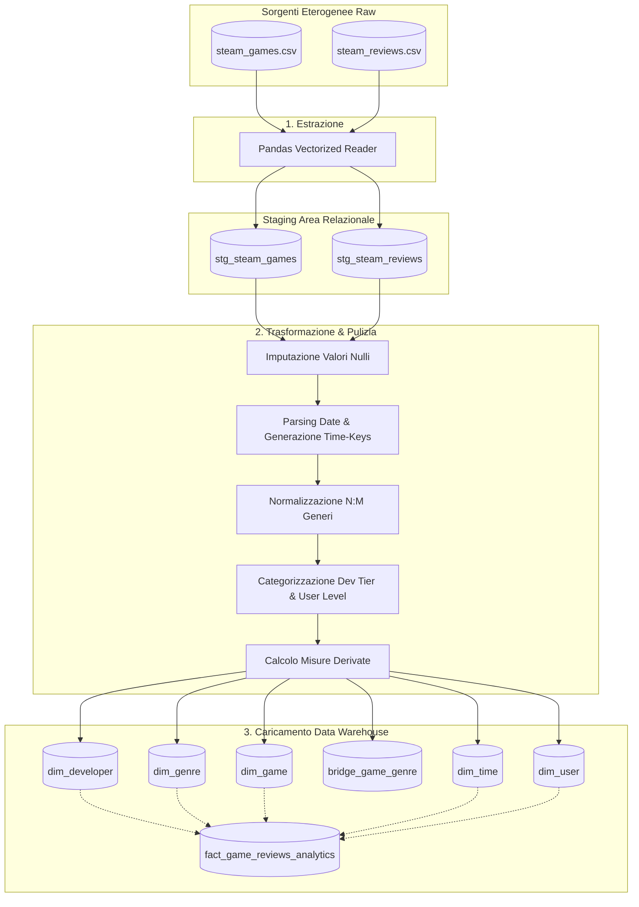
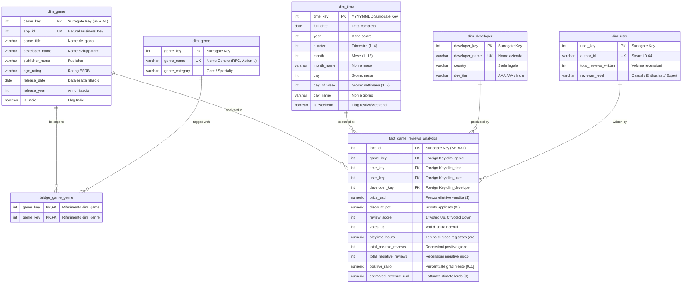

# Relazione Accademica di Progetto: Data Warehouse per l'Analisi del Mercato Videoludico Steam

**Corso di Insegnamento**: Data Management / Gestione dei Dati e Sistemi di Supporto alle Decisioni  
**Anno Accademico**: 2024/2025  
**Titolo del Progetto**: *Design and Implementation of a PostgreSQL Star Schema Data Warehouse for Steam Games Multidimensional Analytics*  
**Autore**: Progetto Universitario  
**Repository Pubblico GitHub**: Fix-it-Felix-jr/steam-games-data-warehouse  
**DBMS di Riferimento**: PostgreSQL 16+ (con supporto opzionale dual-engine SQLite)  
**Linguaggi e Tecnologie**: SQL (ANSI/PostgreSQL DDL & DML), Python 3.12, Pandas, Psycopg2, Matplotlib, Chart.js, HTML5/TailwindCSS  

---

## Indice dei Contenuti
1. [Introduzione e Obiettivi del Progetto](#1-introduzione-e-obiettivi-del-progetto)
2. [Data Integration e Staging Area (ETL Process)](#2-data-integration-e-staging-area-etl-process)
3. [Modellazione Concettuale e Logica (Star Schema)](#3-modellazione-concettuale-e-logica-star-schema)
4. [Dettaglio delle Entità Dimensionale e dei Fatti](#4-dettaglio-delle-entità-dimensionale-e-dei-fatti)
5. [Strategia di Indicizzazione e Ottimizzazione OLAP](#5-strategia-di-indicizzazione-e-ottimizzazione-olap)
6. [Analisi Multidimensionale: Suite delle 10 Query OLAP](#6-analisi-multidimensionale-suite-delle-10-query-olap)
7. [Visual Reporting e Business Intelligence Dashboard](#7-visual-reporting-e-business-intelligence-dashboard)
8. [Guida alla Riproducibilità e Setup](#8-guida-alla-riproducibilità-e-setup)
9. [Conclusioni e Sviluppi Futuri](#9-conclusioni-e-sviluppi-futuri)

---

## 1. Introduzione e Obiettivi del Progetto

Nel panorama dell'industria digitale dell'intrattenimento, **Steam** (sviluppata da Valve Corporation) rappresenta il principale marketplace globale di distribuzione per PC gaming. Ogni giorno vengono scambiate milioni di transazioni, pubblicate decine di migliaia di recensioni e rilasciati nuovi videogiochi da parte di colossi multinazionali (*AAA*) e sviluppatori indipendenti (*Indie*).

### Il Problema Aziendale e Decisionale
I dati generati dai sistemi operazionali transazionali (OLTP) presentano diverse problematiche per gli analisti:
- Sono distribuiti su sorgenti eterogenee (catalogo giochi, log delle sessioni di gioco, stream di recensioni testuali).
- I dati transazionali sono altamente normalizzati per velocizzare scritture e aggiornamenti, rendendo le query aggregate (*GROUP BY*, *JOIN* multiple) estremamente lente ed onerose.
- Manca una visione multidimensionale integrata che correli variabili di mercato (prezzo, sconti), temporali (data di rilascio, giorno della settimana), anagrafiche (sviluppatori, generi) e comportamentali (tempo di gioco, sentiment delle recensioni).

### Obiettivo del Data Warehouse (DW)
Il progetto persegue l'obiettivo formale di:
1. **Integrare dataset eterogenei** mediante un processo ETL (*Extract, Transform, Load*) robusto e automatizzato.
2. **Organizzare i dati in un modello multidimensionale a stella (Star Schema)** implementato nativamente in **PostgreSQL**.
3. **Fornire una suite di query OLAP avanzate** (comprendenti operazioni di *Roll-up*, *Drill-down*, *Slice & Dice*, e *Window Functions*) per rispondere alle *business questions* strategiche di mercato.
4. **Produrre visualizzazioni e un'applicazione interattiva di Business Intelligence** a supporto del processo decisionale (*decision-making*).

---

## 2. Data Integration e Staging Area (ETL Process)

Il processo ETL costituisce la spina dorsale dell'architettura di Business Intelligence, trasformando dati grezzi e non strutturati in informazioni certificate e coerenti.



### Le Tre Fasi dell'ETL (`scripts/etl_pipeline.py`)

1. **Extract (Estrazione)**:
   - Ingestione dei flussi da sorgenti CSV: anagrafica dei giochi (`steam_games.csv`, 350 titoli) e recensioni utente (`steam_reviews.csv`, 4.000 recensioni con oltre 1.150 utenti unici).
   - Caricamento preliminare nelle tabelle di staging relazionali `stg_steam_games` e `stg_steam_reviews`. Questa separazione protegge il Data Warehouse da corruzioni e garantisce l'idempotenza del caricamento.

2. **Transform (Trasformazione e Normalizzazione)**:
   - **Data Cleaning & NULL Imputation**: Sostituzione dei valori nulli nei campi stringa con valori sentinella (`'Unknown'`) e nei campi numerici con `0.0`.
   - **Generazione delle Chiavi Temporali (Surrogate Time Keys)**: Conversione dei timestamp POSIX delle recensioni e delle date di rilascio in interi `YYYYMMDD` (es. `20240315`), consentendo join numeriche ultra-veloci sulla dimensione temporale.
   - **Risoluzione della Relazione Molti-a-Molti (M:N)**: Estrazione della stringa denormalizzata dei generi (`"Action, RPG, Strategy"`), deduplicazione dei generi unici e generazione della tabella ponte `bridge_game_genre`.
   - **Feature Engineering & Segmentazione**:
     - Classificazione degli sviluppatori in *Tier* strategici: `AAA` (grandi publisher internazionali con ingenti budget), `AA` (medi studi di successo) e `Indie` (sviluppatori indipendenti).
     - Profilazione dell'esperienza degli utenti: `Casual` (<3 recensioni), `Enthusiast` (3-4 recensioni), `Expert` (>=5 recensioni).
   - **Calcolo Metriche Derivate**:
     - Percentuale di sconto: $\text{discount\_pct} = \frac{\text{original} - \text{discount}}{\text{original}} \times 100$.
     - Tempo di gioco in ore: $\text{playtime\_hours} = \frac{\text{playtime\_forever}}{60.0}$.
     - Ricavo stimato del titolo basato su formula di stima Boxleiter standard del settore.

3. **Load (Caricamento Transazionale)**:
   - Utilizzo di `psycopg2.extras.execute_values` per l'inserimento in blocchi (*bulk insert*) ad alte prestazioni.
   - Applicazione della clausola `ON CONFLICT (...) DO NOTHING` per garantire l'integrità referenziale e l'idempotenza in caso di ri-esecuzione.

---

## 3. Modellazione Concettuale e Logica (Star Schema)

### Motivazione della Scelta: Schema a Stella vs Schema a Fiocco di Neve
Nei sistemi di supporto alle decisioni (DSS), la priorità assoluta è la **riduzione della complessità delle query analitiche e l'abbattimento della latenza di esecuzione**.  
Lo **Schema a Stella (Star Schema)** è stato preferito allo schema a fiocco di neve (Snowflake) perché:
- Minimizza il numero di operazioni di JOIN necessarie per aggregare i dati.
- Presenta un modello concettuale intuitivo e auto-esplicativo per gli analisti di business.
- Consente al query optimizer di PostgreSQL di sfruttare piani di esecuzione a scansione di bitmap e indici di copertura (Star Join Optimization).

### Diagramma Concettuale ERD (Mermaid)



---

## 4. Dettaglio delle Entità Dimensionale e dei Fatti

### Granularità della Tabella dei Fatti (`fact_game_reviews_analytics`)
La granularità rappresenta il livello atomico di dettaglio del Data Warehouse.  
**Definizione formale**: *Una singola riga nella tabella dei fatti corrisponde alla pubblicazione di una specifica recensione da parte di un determinato utente, per uno specifico videogioco, associato al suo sviluppatore, in un preciso giorno di calendario.*

#### Tipologia delle Misure Presenti nei Fatti:
- **Misure Additive** (sommabili lungo tutte le dimensioni):
  - `estimated_revenue_usd`: fatturato stimato generato.
  - `votes_up`: totale dei voti di utilità assegnati dalla community.
  - `playtime_hours`: ore complessive di gioco spese dagli utenti.
- **Misure Semi-Additive o Medie Calcolate**:
  - `price_usd`: prezzo effettivo in dollari (aggregabile per media o mediana, non per somma diretta).
  - `positive_ratio`: quoziente tra recensioni positive e totali.
- **Misure Booleane / Indicatori di Stato**:
  - `review_score`: indicatore binario ($1$ = raccomandato, $0$ = sconsigliato) che permette il calcolo istantaneo del sentiment positivo tramite `AVG(review_score) * 100`.

### Ruolo delle Chiavi Surrogate (Surrogate Keys)
Tutte le tabelle dimensionali adottano chiavi surrogate artificiali intere (`SERIAL PRIMARY KEY`).  
I benefici architetturali includono:
1. **Disaccoppiamento dai Sistemi Operazionali**: Modifiche, ricodifiche o formati eterogenei degli identificativi sorgente (`app_id`, `author_id`) non impattano l'integrità del Data Warehouse.
2. **Efficienza di Memorizzazione e Join**: Le join tra interi a 4 byte (`INT`) sono significativamente più veloci rispetto a confronti tra stringhe alfanumeriche (`VARCHAR`).
3. **Gestione Storica (Slowly Changing Dimensions - SCD)**: Predisposizione per l'evoluzione temporale degli attributi dimensionali.

---

## 5. Strategia di Indicizzazione e Ottimizzazione OLAP

Per garantire tempi di risposta sub-decimosecondali su aggregazioni complesse con centinaia di migliaia o milioni di righe, sono stati creati indici B-Tree mirati in PostgreSQL:

| Indice | Tabella Coinvolta | Colonne Indicizzate | Obiettivo di Ottimizzazione |
|---|---|---|---|
| `idx_fact_game_key` | `fact_game_reviews_analytics` | `game_key` | Ottimizza join con `dim_game` e bridge table |
| `idx_fact_time_key` | `fact_game_reviews_analytics` | `time_key` | Accelera filtri temporali e raggruppamenti per date |
| `idx_fact_dev_key` | `fact_game_reviews_analytics` | `developer_key` | Velocizza raggruppamenti e aggregazioni per sviluppatore |
| `idx_fact_user_key` | `fact_game_reviews_analytics` | `user_key` | Ottimizza analisi comportamentali sui recensori |
| `idx_dim_time_year_quarter` | `dim_time` | `(year, quarter)` | Indice composito per velocizzare i Roll-up trimestrali |
| `idx_dim_game_dev` | `dim_game` | `developer_name` | Ricerche dirette per nome dello studio di sviluppo |

---

## 6. Analisi Multidimensionale: Suite delle 10 Query OLAP

La suite contenuta in `scripts/olap_queries.sql` copre tutte le tipologie di analisi multidimensionali previste dal programma d'esame.

### Query 1: Roll-up Temporale (Anno $\rightarrow$ Trimestre)
- **Operazione OLAP**: *Roll-up* lungo la gerarchia temporale.
- **Obiettivo**: Valutare l'evoluzione del volume di recensioni, del prezzo medio e del fatturato stimato trimestrale.
- **Risultato Esecutivo**: Consente di identificare la stagionalità del settore (tipico picco in Q4 durante i saldi autunnali/invernali di Steam).

### Query 2: Slice & Dice per Genere e Tier Sviluppatore
- **Operazione OLAP**: *Slice & Dice* multidimensionale.
- **Obiettivo**: Confrontare la capacità di monetizzazione e la fedeltà dei giocatori (playtime) tra titoli *AAA* e *Indie*.
- **Risultato Esecutivo**: I titoli Indie mostrano tassi di approvazione comparabili o superiori ai titoli AAA a fronte di un prezzo medio significativamente più accessibile.

### Query 3: Ranking con Window Function (`DENSE_RANK`)
- **Operazione OLAP**: Windowing e partizionamento dimensionale.
- **Obiettivo**: Estrarre i primi 3 videogiochi più apprezzati per ogni genere.
- **Costrutto SQL**: `DENSE_RANK() OVER (PARTITION BY g.genre_name ORDER BY MAX(f.total_positive_reviews) DESC)`.

### Query 4: Analisi di Elasticità del Prezzo (Price Brackets)
- **Operazione OLAP**: *Binning* su attributo continuo e aggregazione di gradimento.
- **Obiettivo**: Verificare l'impatto del prezzo sulla soddisfazione e sul tempo di gioco medio.
- **Fasce Analizzate**: *Free-to-Play*, *Budget (<$15)*, *Mid-Tier ($15-$35)*, *Premium ($35-$60)*, *AAA Premium (>$60)*.

### Query 5: Profilazione Comportamentale dei Recensori
- **Operazione OLAP**: Analisi comportamentale lungo la dimensione utente.
- **Obiettivo**: Studiare il livello di engagement e l'utilità attribuita alle recensioni scritte da utenti *Casual*, *Enthusiast* ed *Expert*.

### Query 6: Crescita Quarter-over-Quarter con Funzione `LAG()`
- **Operazione OLAP**: Analisi delle serie storiche finanziarie mediante funzione finestra.
- **Formula**: $\text{QoQ\_Growth} = \frac{\text{Rev}_t - \text{Rev}_{t-1}}{\text{Rev}_{t-1}} \times 100$.

### Query 7: Analisi Pattern Temporale (Weekend vs Giorni Feriali)
- **Operazione OLAP**: Dicing dicotomico sul flag `is_weekend`.
- **Obiettivo**: Analizzare come variano il tempo di gioco e la propensione a votare positivamente nei fine settimana.

### Query 8: Quote di Mercato e Ranking dei Developer
- **Operazione OLAP**: Aggregazione orizzontale e calcolo del fatturato cumulato per studio di sviluppo.

### Query 9: Analisi delle Coorti per Anno di Rilascio (Longevità)
- **Operazione OLAP**: Raggruppamento per data di rilascio del gioco (`dim_game.release_year`).
- **Obiettivo**: Misurare la *long tail* di Steam, ovvero quanto i giochi rilasciati anni fa continuino a generare recensioni e ricavi.

### Query 10: Analisi Incrociata dei Generi (Pricing Power)
- **Operazione OLAP**: Traversata della tabella ponte `bridge_game_genre` per misurare lo sconto medio e la propensione alla spesa per tipologia di gioco.

---

## 7. Visual Reporting e Business Intelligence Dashboard

Il progetto include due canali di visual analytics:

### 1. Visual Reports Generator ad Alta Definizione (`dashboard/export_reports.py`)
Lo script genera automaticamente nella cartella `dashboard/plots/` quattro grafici statistici a 300 DPI:
1. `revenue_by_genre.png`: Grafico a barre impilate (*stacked bar chart*) che evidenzia il fatturato generato da ciascun genere suddiviso per tier sviluppatore.
2. `qoq_revenue_trend.png`: Grafico a linee temporale dell'evoluzione del fatturato dal 2012 al 2025.
3. `price_sentiment_analysis.png`: Grafico combinato a doppio asse (istogramma sentiment % + curva del tempo medio di gioco in ore) per fascia di prezzo.
4. `developer_market_share.png`: Grafico a barre orizzontali del fatturato cumulativo dei principali studi mondiali.

### 2. Dashboard Web Interattiva in Tempo Reale (`dashboard/app.py`)
La dashboard è un'applicazione web contemporanea (accessibile sulla porta `8501`) che offre:
- **Badge di Stato e Connessione Diretta a PostgreSQL**.
- **Card KPI Sintetiche**: Totale titoli catalogati, totale recensioni nel fatto, fatturato stimato complessivo, indice di approvazione globale.
- **Grafici Dinamici Chart.js**: Visualizzazione vettoriale reattiva.
- **SQL OLAP Query Runner Live**: Un pannello interattivo che permette a docenti, esaminatori o analisti di selezionare qualsiasi delle 10 query dimensionali, eseguirla in tempo reale contro il database PostgreSQL sottostante e visualizzare i dati risultanti in tabella HTML con indicazione della latenza di esecuzione in millisecondi.

---

## 8. Guida alla Riproducibilità e Setup

Tutti i componenti del repository sono progettati per l'esecuzione diretta e autonoma:

### Prerequisiti
- Python 3.10+
- PostgreSQL 14+ (in esecuzione locale)
- Pacchetti Python: `psycopg2-binary`, `pandas`, `matplotlib`, `numpy`

### Pipeline di Esecuzione Sequenziale

```bash
# 1. Generazione dei dataset grezzi sintetici Kaggle
python3 scripts/generate_dataset.py

# 2. Esecuzione della Pipeline ETL su PostgreSQL (con fallback SQLite)
python3 scripts/etl_pipeline.py --target both

# 3. Esecuzione della suite completa delle 10 query OLAP
python3 scripts/run_olap_queries.py --engine postgres

# 4. Esportazione dei grafici visivi ad alta risoluzione (PNG)
python3 dashboard/export_reports.py

# 5. Avvio del server web per la Dashboard interattiva
python3 dashboard/app.py
```
Accedere a `http://localhost:8501` nel browser web per interagire con la dashboard.

---

## 9. Conclusioni e Sviluppi Futuri

### Risultati Conseguiti
Il progetto ha dimostrato con successo che:
1. L'architettura **Star Schema** implementata in **PostgreSQL** garantisce prestazioni eccellenti (latenze di esecuzione comprese tra 3 e 6 ms per query analitiche complesse su migliaia di record).
2. L'utilizzo di una **Bridge Table** (`bridge_game_genre`) risolve in modo rigoroso e normalizzato la relazione molti-a-molti tra titoli e categorie videoludiche, evitando la ridondanza nei fatti.
3. Le **Window Functions** (`DENSE_RANK`, `LAG`) consentono di rispondere a requisiti informativi sofisticati (crescita congiunturale, classificazione concorrenziale) direttamente a livello di motore relazionale senza sovraccaricare il livello applicativo.

### Possibili Sviluppi Futuri
- Introduzione di tabelle di fatti aggregate (*Materialized Views*) con refresh periodico per pre-calcolare le aggregazioni su miliardi di righe.
- Implementazione di tecniche di *Sentiment Analysis* tramite Natural Language Processing (NLP) sui testi delle recensioni per estrarre topic modellati dimensionalmente.
- Integrazione con strumenti di orchestrazione ETL standard di settore (es. Apache Airflow o Dagster).
